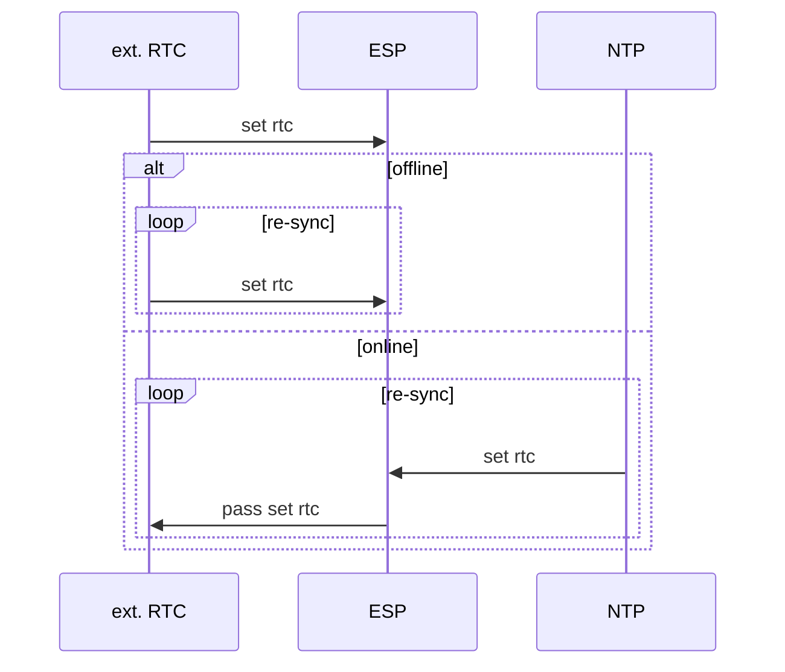
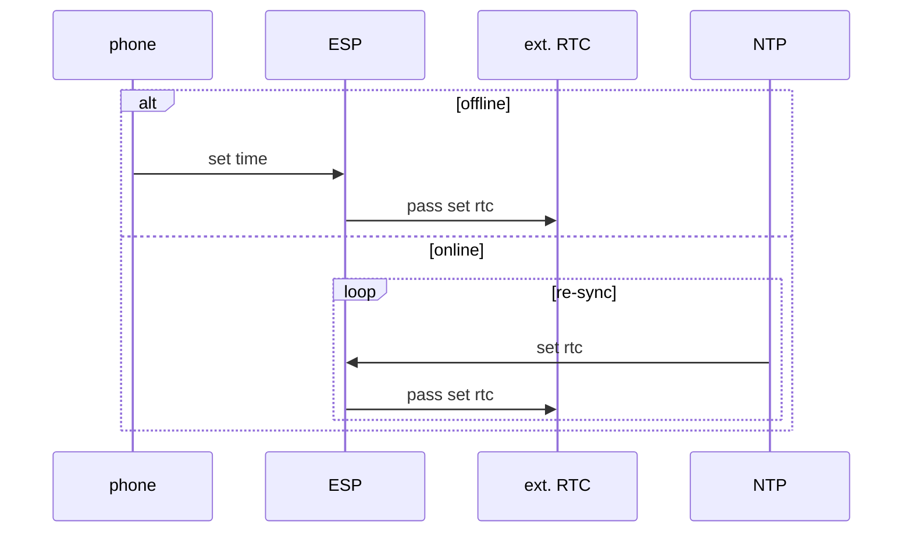

# Time Sync Scenarios

The diagrams below detail the current plan for synchronization of different clocks.

__TODO__: Do we need to set the time over OCPP?

## on boot

```mermaid
sequenceDiagram
    ext. RTC->>ESP: set rtc

    alt offline
        loop re-sync
        ext. RTC->>ESP: set rtc
      end
    else online
        loop re-sync
            NTP->>ESP: set rtc
            ESP->>ext. RTC: pass set rtc
        end
    end
```

## Initial setup

```mermaid
sequenceDiagram
    alt offline
        phone->>ESP: set time
        ESP->>ext. RTC: pass set rtc
    else online
        loop re-sync
            NTP->>ESP: set rtc
            ESP->>ext. RTC: pass set rtc
        end
    end
```
